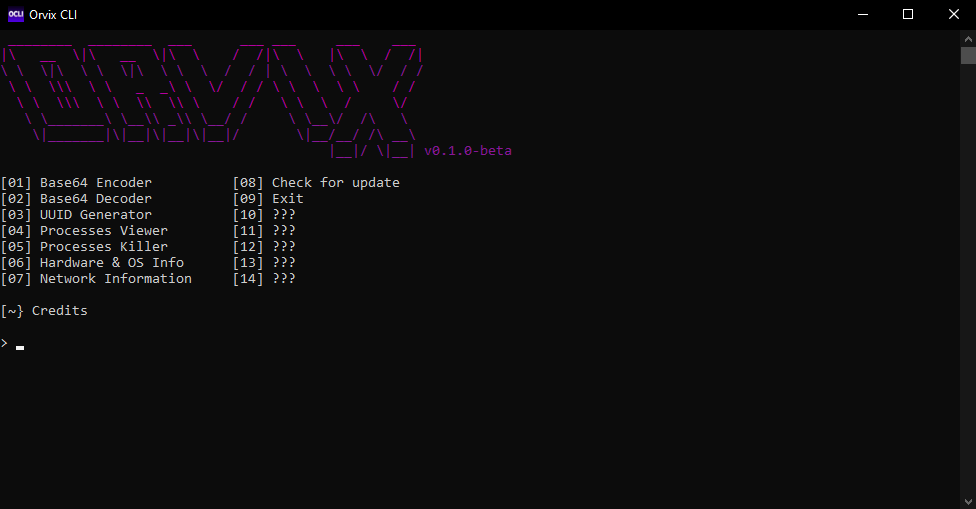

# Preview:

## 🚀 Getting Started

### 📦 Requirements
- Windows OS
- [.NET Framework 4.7.2 Runtime](https://dotnet.microsoft.com/en-us/download/dotnet-framework/net472)

> Most modern Windows systems already include this by default

### 📥 Download
Download the latest release from the [Releases](https://github.com/mahmoodnotfound/OrvixCLI/releases) page

After downloading, extract the .zip file
No installation needed just run the `OrvixCLI.exe`

## 🙏 Credits

- **OpenHardwareMonitorLib** – For accessing detailed hardware statistics (CPU, GPU, RAM, etc.)

## 💬 Notes

- Run with admin privileges for full functionality (e.g., process killing)
- Want to suggest a feature or report a bug? open an [issue](https://github.com/mahmoodnotfound/OrvixCLI/issues).
